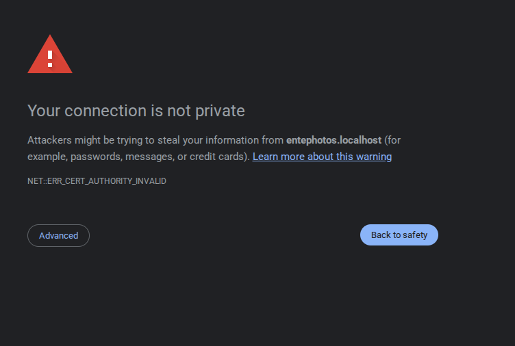
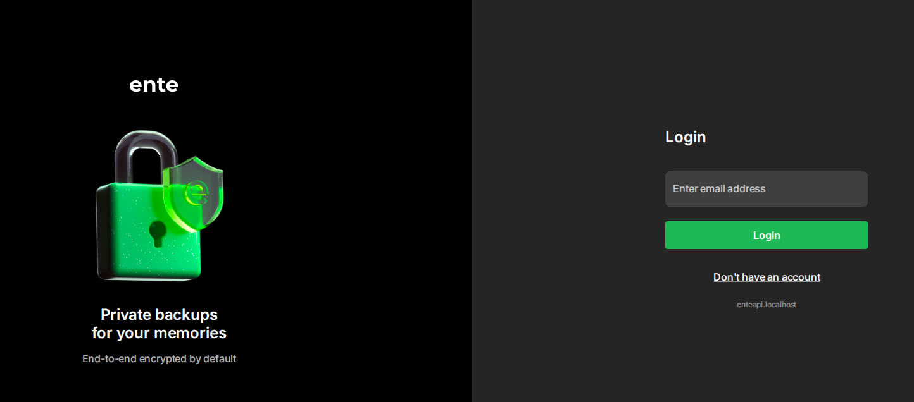
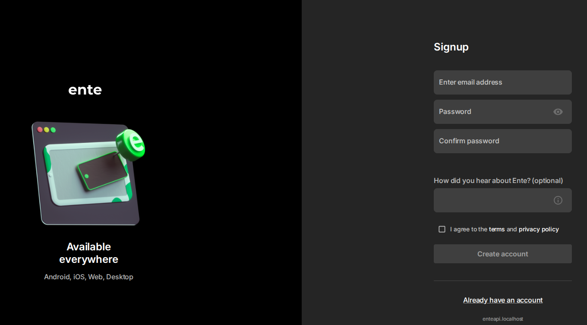
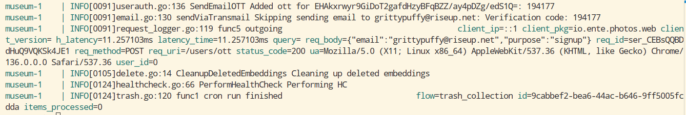

# Ente

Ente is an end-to-end encrypted platform that provides 2 major services:

1. **Ente Photos:** Encrypted backup and sharing of photos as an alternative to mainstream, proprietary, privacy-invasive services such as Google Photos, Apple Photos, etc.
2. **Ente Auth:** E2E authenticator application for 2-factor authentication as an alternative to local 2FA apps or proprietary, cloud-based applications such as Microsoft Authenticator, etc.

## Pre-requisites

To self-host Ente Photos and/or Ente Auth, you will need the following on your system:

1. **Docker and Docker Compose:** Needed for running the services in a containerized manner. Ensure you have Docker and Docker Compose by running:
    ``` sh
    docker -v
    docker compose -v
    ```

2. **curl:** This is needed for obtaining the `quickstart.sh` script.
    ``` sh
    curl --version
    ```


## Getting started

### Run `quickstart.sh`

``` sh
sh -c "$(curl -fsSL https://raw.githubusercontent.com/ente-io/ente/main/server/quickstart.sh)"
```

It should create a directory `my-ente`, create the YAML files needed for Compose and configuration of it with needed credentials that are randomly generated, and starts the containers.

The default configuration is acceptable for local usage and testing, however, for production or usage in other networks:
1. The endpoints have to be properly configured
2. HTTPS has to be enabled with SSL certificates
3. Reverse proxy or tunneling must be used

Stop the running containers in `my-ente` directory using `docker compose down --volumes`. This will remove the containers, network bridges and storage volumes, leading to loss of data. This is important since stale volumes cause issue when trying to restart containers with database connectivity.

### Configure endpoints

In `compose.yaml` file, find the following section and change `ENTE_API_ORIGIN` and `ENTE_ALBUM_ORIGIN` to the endpoint configured for API and albums. Configure A or AAAA records for the same with your DNS provider if you're using a custom domain.

In case of local deployment, suffixing with localhost for domain for both the endpoints should work

``` yaml
services:
  ...
  web:
    image: ghcr.io/ente-io/web
    # Uncomment what you need to tweak.
    ports:
      - 3000:3000 # Photos web app
      # - 3001:3001 # Accounts
      - 3002:3002 # Public albums
      # - 3003:3003 # Auth
      # - 3004:3004 # Cast
    # environment: // [!code --]
    #   ENTE_API_ORIGIN: http://localhost:8080 // [!code --]
    #   ENTE_ALBUMS_ORIGIN: https://localhost:3002 // [!code --]
    environment:
      ENTE_API_ORIGIN: https://enteapi.localhost # [!code ++]
      ENTE_ALBUMS_ORIGIN: https://entealbum.localhost # [!code ++]
```

### Configure Storage

In `museum.yaml`, edit the following section to configure SSL, endpoint and enable path-style URLs.

``` yaml
s3:
  are_local_buckets: true # [!code --]
  are_local_buckets: false # [!code ++]
  use_path_style_urls: true # [!code ++]
  b2-eu-cen:
    key: minio-user-FTyZyXAO
    secret: PJigYz/4/3EiZ8raSe+a2/fobfyY
    endpoint: http://localhost:3200 # [!code --]
    endpoint: https://entestorage.localhost # [!code ++]
    region: eu-central-2
    bucket: b2-eu-cen
```

### Configure Caddy

Configure reverse proxying by editing `Caddyfile` in `my-ente` directory

``` groovy
enteapi.localhost {
    reverse_proxy museum:8080 {
        header_up Host entephotos.localhost
    }
    tls internal
}

entephotos.localhost {
    reverse_proxy web:3000
    header {
        X-Forwarded-For {remote_host}
        X-Forwarded-Proto {scheme}
        Access-Control-Allow-Methods "GET, POST, PUT, DELETE"
        Access-Control-Allow-Headers "*"
        Access-Control-Max-Age "3000"
        Access-Control-Expose-Headers "Etag"
    }
    tls internal
}

entealbum.localhost {
    reverse_proxy web:3002
    tls internal
}

entestorage.localhost {
    reverse_proxy minio:3200
    tls internal
}
```

::: tip
If you are facing an error describing address is already in use:
> Error: loading initial config: loading new config: http app module: start: listening on :443: listen tcp :443: bind: address already in use

Identify the process using the port (the port will generally be 443 because of HTTPS configuration) by using netstat:

``` sh
sudo netstat -tulpn | grep :443 
```
:::

### Configure networking

Configure extra hosts for museum service in `compose.yaml` with the mapping to the internal IP address of the Docker container. This is needed since uploads will fail as the address resolution will fail inside the docker container of museum.

``` yaml
services:
  museum:
    ...
    extra_hosts:
      - "entestorage.localhost:172.17.0.1"
```

### Add Caddy Container

Caddy is required for generation of self-signed SSL certificates and reverse proxying requests with the appropriate headers. This can be either done by installing the binary on the host system and configuring using system-wide configuration or using a Docker container, though the former is advisable for production usage.

Add the following configuration for Caddy container in `compose.yaml` and remove the configuration for socat
``` yaml
services:
  ...
  caddy: # [!code ++]
    image: caddy:2 # [!code ++]
    ports: # [!code ++]
      - 80:80 # [!code ++]
      - 443:443 # [!code ++]
    volumes: # [!code ++]
      - ./Caddyfile:/etc/caddy/Caddyfile # [!code ++]
      - caddy_data:/data # [!code ++]
      - caddy_config:/config # [!code ++]
    depends_on: # [!code ++]
      - museum # [!code ++]
      - web # [!code ++]
  socat: # [!code --]
   image: alpine/socat # [!code --]
   network_mode: service:museum # [!code --]
   depends_on: [museum] # [!code --]
   command: "TCP-LISTEN:3200,fork,reuseaddr TCP:minio:3200" # [!code --]
```

### Start clusters

Now that everything is configured, start the cluster using Docker Compose

``` sh
docker compose up
```

### Copy the certificates and update trust

Once the cluster has been started and all services have been initiated

1. Install `ca-certificates` package and update it
    ``` sh  
    docker exec -it my-ente-museum-1 sh -c "apk add ca-certificates"

2. Copy the root CA from Caddy container
    
    ``` sh
    docker cp my-ente-caddy-1:/usr/local/share/ca-certificates/caddy-root.crt ./caddy-root.crt
    ```

    This should result in a similar message:
    
    ```
    Successfully copied 2.56kB to ./caddy-root.crt
    ```
3. Copy the same into Museum container
    ``` sh
    docker cp ./caddy-root.crt my-ente-museum-1:/usr/local/share/ca-certificates/caddy-root.crt
    ```

    This should result in a similar message:

    ```
    Successfully copied 2.56kB to my-ente-museum-1:/usr/local/share/ca-certificates/caddy-root.crt
    ```
4. Update the certificates
    ``` sh  
    docker exec -it my-ente-museum-1 sh -c "update-ca-certificates"
    ```

::: tip
To verify if HTTPS connectivity has been established without unknown certificates error, do a quick ping test.
``` sh
wget https://entestorage.localhost
```

The output should be similar to the below one

```
Connecting to entestorage.localhost (172.17.0.1:443)
wget: server returned error: HTTP/1.1 403 Forbidden
```
:::

## Post-installation

### Creating an account

> [!NOTE]
> While using a `localhost` domain with HTTPS, browsers generally display a warning saying your connection is not private, which is a common occurence with self-signed certificate. You can ignore this warning and proceed.
> 
> 
> 
> This is applicable for other requests from backend as well and the domains (`enteapi.localhost`, `entestorage.localhost`) have to be visited in browser tab once to rectify this error.


1. Open the configured web application's endpoint (https://entephotos.localhost or https://photos.example.com) in your browser. You should be greeted with a similar screen

    

2. Create an account by clicking "Don't have an account" with your email address and password.

    

3. Once the account creation has been successful, you will be prompted to enter a verification code. This code is available in the Docker compose logs that can be accessed by:
    
    ``` sh
    sudo docker compose logs
    ```

    You should be seeing similar logs with the verification code. Enter the verification code in the application

    

4. You will be prompted to save your recovery code. Save it in a safe location, it's **the only way** to recover your account in case you **lose access to your account.**

Congratulations! You're all set to upload your photos and backup on your local machine (if using local configurations) or via the Internet.

## References

1. https://help.ente.io/self-hosting