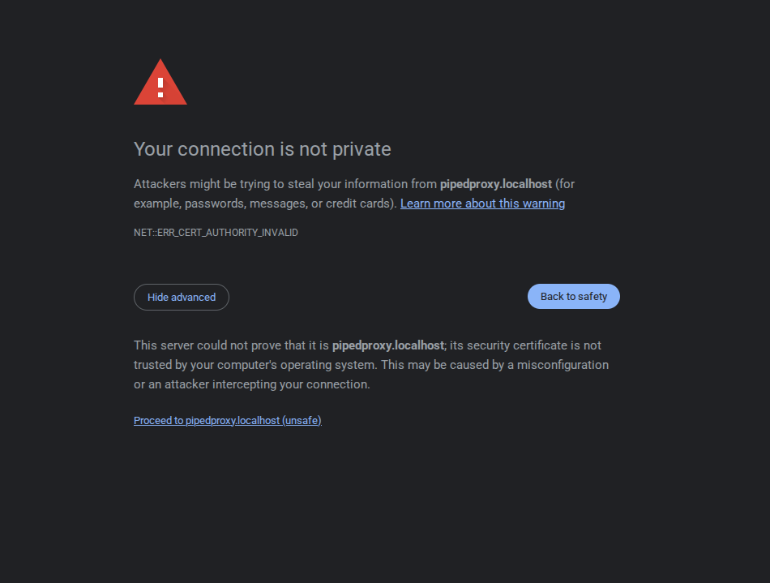
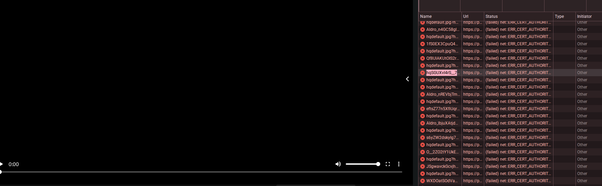

# Piped

Piped is a free and open source frontend for viewing YouTube videos and supports login, subscriptions, feeds, playlists without needing a YouTube account.

# Pre-requisites

To self-host Piped, you will need the following on your system:

1. **Docker and Docker Compose:** Needed for running the services in a containerized manner. Ensure you have Docker and Docker Compose by running:
    ``` sh
    docker -v
    docker compose -v
    ```

2. **Git:** This is needed for cloning the project to obtain configuration files and scripts
    ``` sh
    git -v
    ```


# Getting started

1. Clone the repository.
    ``` sh
    git clone https://github.com/TeamPiped/Piped-Docker
    ```

2. Configure the instance's details
    ``` sh
    cd Piped-Docker
    ./configure-instance.sh
    ```

    This should prompt for the following details:
    - Frontend hostname
    - Backend hostname
    - Proxy hostname
    - Reverse proxy: Caddy, nginx, standalone
    - Connectivity: HTTPS or HTTP

    ### Local configuration

    When using local system without any domain configuration, you will have to suffix the hostnames with `localhost` for generation of certificates without hassle.
    ``` md
    Enter a hostname for the Frontend (eg: piped.kavin.rocks):
    `piped.localhost`
    Enter a hostname for the Backend (eg: pipedapi.kavin.rocks):
    `pipedapi.localhost`
    Enter a hostname for the Proxy (eg: pipedproxy.kavin.rocks):
    `pipedproxy.localhost`
    Enter the reverse proxy you would like to use (caddy, nginx or standalone):
    `caddy`
    Is your hostname reachable via HTTP or HTTPS? (eg: https)
    `https`
    ```

    ### Configuration with a domain

    When using a custom domain, create the needed `A` or `AAAA` records for the subdomains for frontend, backend and proxy with the server machine's public IP address with the DNS provider of your choice, this will usually be of domain registrar or other services.
    
    Assuming your domain is `example.com`, you can enter the values as follows (but not necessarily the same):
    ``` md
    Enter a hostname for the Frontend (eg: piped.kavin.rocks):
    `piped.example.com`
    Enter a hostname for the Backend (eg: pipedapi.kavin.rocks):
    `pipedapi.example.com`
    Enter a hostname for the Proxy (eg: pipedproxy.kavin.rocks):
    `pipedproxy.example.com`
    Enter the reverse proxy you would like to use (caddy, nginx or standalone):
    `caddy`
    Is your hostname reachable via HTTP or HTTPS? (eg: https)
    `https`
    ```

    This should create the Docker Compose file (`docker-compose.yml`) needed for running Piped.
3. Start the service using Docker Compose
    ``` sh
    docker compose up
    ```

    You should be able to access the application at `https://piped.example.com` or `https://piped.localhost` (if you're running locally) on your web browser.

    > [!NOTE]
    > While using a `localhost` domain with HTTPS, browsers generally display a warning saying your connection is not private, which is a common occurence with self-signed certificate. You can ignore this warning and proceed.
    > 
    > 
    > 
    > This is applicable for other requests from backend as well and the domains (`pipedapi.localhost`, `pipedproxy.localhost`) have to be visited in browser tab once to rectify this error.
    >
    > 

Congratulations! You're all set to browse YouTube privately.
# References

1. https://docs.piped.video/docs/self-hosting/